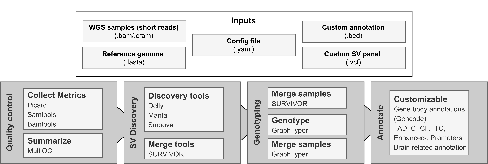

# *snakeSV*: Flexible framework for large-scale SV discovery

[](http://bioconda.github.io/recipes/snakesv/README.html)

---

*snakeSV* is an integrated pipeline in Snakemake for complete SV analysis. The pipeline includes pre- and post-processing steps to deal with large scale studies. The input data of the pipeline consists of BAM files for each sample, a reference genome file (.FASTA) and a configuration file in yaml format. Additionally, users can also input custom annotation files in BED format for SV interpretation and VCF files with structural variants to be genotyped in addition to the discovery set.



---

Getting Started
---------------

The easiest way of using *snakeSV* is using Bioconda!

Install *snakeSV* by creating a separated environment (named "snakesv_env") with the command:
```
conda create -n snakesv_env -conda-forge -c bioconda snakesv
conda activate snakesv_env # Command to activate the environment. To deactivate use "conda deactivate"
```

After installing, to test if everything is working well, you can run the pipeline with an example data set included.
```
# First create a folder to run the test
mkdir snakesv_test
cd snakesv_test

# Run the snakeSV using example data.
snakeSV --test_run
```

You can also test an installation and small test runs using **Google Cloud Shell** [here](https://shell.cloud.google.com/?ephemeral=true&cloudshell_tutorial=docs/install_tutorial.md&shellonly=true)

---------------

For more details check the [wiki](https://github.com/RajLabMSSM/snakeSV/wiki) pages for detailed [configuration](https://github.com/RajLabMSSM/snakeSV/wiki#3-installation) and [input](https://github.com/RajLabMSSM/snakeSV/wiki#2-inputs) instructions! We also provide 2 [study cases](https://github.com/RajLabMSSM/snakeSV/wiki/Usage-examples) to illustrate uses of customized annotations and genotyping using a panel of SVs discovered using long-reads!


Reference
---------------

Vialle, R.A., Raj, T. (2022). snakeSV: Flexible Framework for Large-Scale SV Discovery. In: Proukakis, C. (eds) Genomic Structural Variants in Nervous System Disorders. Neuromethods, vol 182. Humana, New York, NY. [link](https://doi.org/10.1007/978-1-0716-2357-2_1)
